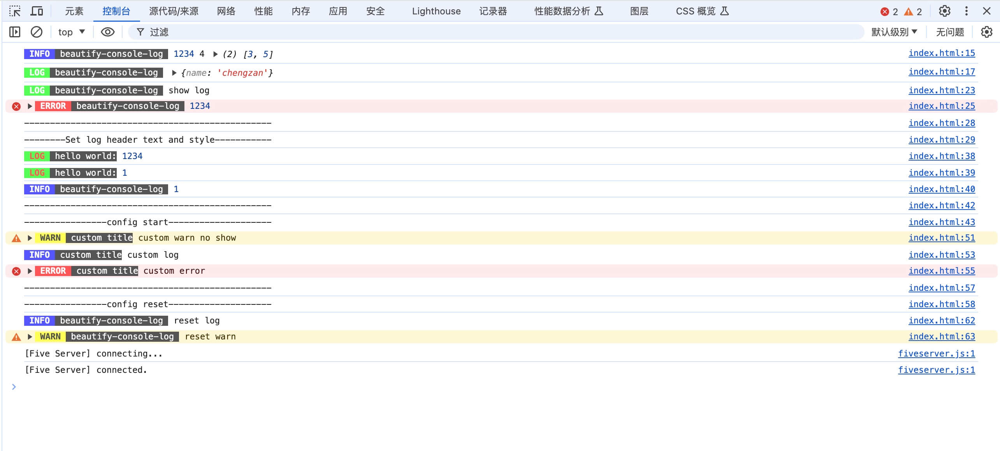

# beautify-console-log

[中文介绍](https://github.com/zancheng/beautify-console-log/blob/master/README.zh.md)

## Introduction

Due to most log beautification plugins not being able to locate the **code line**, I implemented this library myself.
- This is a further beautification and encapsulation of the "console" object, including console. log console.info、console.warn、console.error。
- It can display the number of rows where the log is printed, add custom console printing prefixes, and beautify the content (web side rule reference) [https://developer.mozilla.org/en-US/docs/Web/API/Console](https://developer.mozilla.org/en-US/docs/Web/API/Console) Node environment reference [https://zh.wikipedia.org/wiki/ANSI%E8%BD%AC%E4%B9%89%E5%BA%8F%E5%88%97](https://zh.wikipedia.org/wiki/ANSI%E8%BD%AC%E4%B9%89%E5%BA%8F%E5%88%97)） ）, can close console printing at any time, supports node environment.
> Please check the effect on the console.

## Menu
- [Effect](#Effect)
- [Installation](#Installation)
- [Use](#Use)
- [API](#API)
- [Types](#Types)
- [Utils](#Utils)
- [Contribution](#Contribution)

## Effect
<p>

</p>
<p>

</p>
<p>

</p>
<p>

</p>


## Installation


```

npm i beautify-console-log --save

```

or

```

yarn add beautify-console-log

```
## Use
1. Simple use
- For the convenience of use (and compatibility with older versions), I define parameters as multiple types. For example, when configuring with 'config', you can pass in a 'type' value of 'LogType' type, or pass in strings such as' info ',' log ',' warn ', and' error '`

```javascript
import BeautifyConsole from "beautify-console-log";

const log = BeautifyConsole.getInstance();

//The usage is consistent with the normal console.info()

Log.info(1234, '4', [3, 5]);

```

 or
```javascript
import BeautifyConsole from "beautify-console-log";
const log = new BeautifyConsole();
log.info(111111);
```
 or
```javascript

const log = new BeautifyConsole();

//The usage is consistent with the normal console.info()

Log.info(1234, '4', [3, 5]);

```
Or directly use the `dist/index. js` file
```javascript
<script src="./dist/index.js">
<script>
  const log = BeautifyConsole.default.getInstance()
  log.info(1234, '4', [3, 5])
  // OR
  const log2 = new BeautifyConsole.default()
  log2.error(111)
</script>
```

```javascript
const log = BeautifyConsole.default.getInstance()

log.info(1234, '4', [3, 5])

log.log(1234)

log.close().warn('no show')

log.open().log('show log')

log.error(1234)

log.setPadStartText({
    title: "hello world ->",
    logType: LogType.info,
}).log(1234)
```
If you want to turn off redundant logs in the generation environment, you can configure it as follows:
```javascript
import BeautifyConsole from "beautify-console-log";
import { LogType } from 'beautify-console-log/lib/beautify-console/model';
const log = BeautifyConsole.getInstance();

/**
 * Vite uses import.meta.env MODE retrieves the environment
 */
log.config({
    title: 'custom title',
    type: process.env.NODE_ENV === 'product' ? ['error'] : ['log', 'info', 'warn', 'error']
})
log.info(1234, '4', [3, 5]); // Will not display printing
```
Or
```javascript
import BeautifyConsole from "beautify-console-log";
import { LogType } from 'beautify-console-log/lib/beautify-console/model';
const log = BeautifyConsole.getInstance();

/**
 * Vite uses import.meta.env MODE retrieves the environment
 */
if (process.env.NODE_ENV === 'product') {
  log.close().open(LogType.error);
}
log.info(1234, '4', [3, 5]); // Will not display printing
```

2.  initial configuration
```javascript
const log = BeautifyConsole.getInstance();
import { LogType } from 'beautify-console-log/lib/beautify-console/model';
log.config({
    title: 'example pad start text', // Log header content filled on the left
    type: ['error', 'warn'], // Display partial log types, only display logs of "error" and "warn" types
})
log.info(1234, '4', [3, 5]);
log.log(1234, '4', [3, 5]);
log.warn(1234, '4', [3, 5]);
log.error(1234, '4', [3, 5]);
```

3. Supported console types

```javascript

const log = BeautifyConsole.getInstance();

Log.info(1234, '4', [3, 5]);

Log.log(1234, '4', [3, 5]);

Log.warn(1234, '4', [3, 5]);

Log.error(1234, '4', [3, 5]);

```

4. Add custom console log headers

```javascript

const log = BeautifyConsole.getInstance();

log.setPadStartText({
    title: "hello world ->",
    logType: LogType.info,
}).info(1234,'4 ', [3, 5])

```
5. Close log
Close the corresponding console log types when passing in parameters, and close all types without passing them.
supports chain calling.
```javascript
// ...
const log = BeautifyConsole.getInstance();
log.close(LogType.info);
log.close(LogType.log);
log.close(LogType.warn);
log.close(LogType.error);
log.close();
log.close().open(LogType.error);

// or
log.open(LogType.error).open(LogType.log).open(LogType.warn).open(LogType.info);

// or
log.close(LogType.error).info('closed error');
log.close(LogType.error).error('closed error');

// or
log.close(LogType.error).open(LogType.info);
log.close(LogType.error).open(LogType.info).info('info...');

```

6. Open log
Open the corresponding console log types when passing in parameters, and open all types without passing them.
supports chain calling.

```javascript
// ...
const log = BeautifyConsole.getInstance();
log.open(LogType.info);
log.open(LogType.log);
log.open(LogType.warn);
log.open(LogType.error);
log.open();
log.open().close(LogType.info);

//or
log.open(LogType.error).open(LogType.log).open(LogType.warn).open(LogType.info);

// or
log.open().info('closed error');
log.open(LogType.error).error('closed error');

// or
log.close(LogType.error).open(LogType.info);
log.close(LogType.error).open(LogType.info).info('info...');

```

## API

### config
|param                          |type                         |description                         |
|-------------------------------|-----------------------------|-----------------------------|
|param|BaseConfig||
|├──title                          |String?                       |Custom log header, do not display custom log header when the value is empty                   |
|└──type                        |LogType[] \| ('info' 、 'log' 、 'warn' 、 'error')[]              |The type of log displayed, set to only display the corresponding log type(`LogType.info`、`LogType.log`、`LogType.warn`、`LogType.error`、`"info"`、`"log"`、`"warn"`、`"error"`)|
```javascript
import BeautifyConsole from "beautify-console-log";
import { LogType } from 'beautify-console-log/lib/beautify-console/model';
const log = BeautifyConsole.getInstance();
log.config({
    title: 'custom title',
    type: [LogType.info, LogType.error, 'log']
})
// The usage method is consistent with the normal console.info
log.info(1234, '4', [3, 5]);

// OR
const log2 = new BeautifyConsole();
log2.info(111111);
```
### log
> The usage method is consistent with the normal console.log
```javascript
import BeautifyConsole from "beautify-console-log";
const log = BeautifyConsole.getInstance();
log.log(1234, '4', [3, 5]);
log.log({
    "name": "chengzan"
});
```

### info
> The usage method is consistent with the normal console.info
```javascript
import BeautifyConsole from "beautify-console-log";
const log = BeautifyConsole.getInstance();
log.info(1234, '4', [3, 5]);
log.info({
    "name": "chengzan"
});
```

### warn
> The usage method is consistent with the normal console.warn
```javascript
import BeautifyConsole from "beautify-console-log";
const log = BeautifyConsole.getInstance();
log.warn(1234, '4', [3, 5]);
log.warn('warn');
```

### error
> The usage method is consistent with the normal console.error
```javascript
import BeautifyConsole from "beautify-console-log";
const log = BeautifyConsole.getInstance();
log.error(1234, '4', [3, 5]);
log.error('warn');
```

### open
After using `log.close()` to close the log, you can use `log.open()` to open the corresponding log type. When opening all types of logs, no parameters are passed (support chain calling).
|type                         |description                         |
|-----------------------------|-----------------------------|
|LogType \| "info" \| "log" \| "warn" \| "error"                   |`LogType.info`、`LogType.log`、`LogType.warn`、`LogType.error`、`"info"`、`"log"`、`"warn"`、`"error"`, Or not transmitted|
```javascript
import BeautifyConsole from "beautify-console-log";
import { LogType } from 'beautify-console-log/lib/beautify-console/model';
const log = BeautifyConsole.getInstance();
log.open() // Open all types of logs
// OR
log.open(LogType.info) // Open the info log
// OR
log.open(LogType.info).open('error') // Open the info log
```

### close
Closing logs allows you to close all logs or a certain type of log.
|type                         |description                         |
|-----------------------------|-----------------------------|
|LogType \| "info" \| "log" \| "warn" \| "error"                       |`LogType.info`、`LogType.log`、`LogType.warn`、`LogType.error`、`"info"`、`"log"`、`"warn"`、`"error"`, Or not transmitted|
```javascript
import BeautifyConsole from "beautify-console-log";
import { LogType } from 'beautify-console-log/lib/beautify-console/model';
const log = BeautifyConsole.getInstance();
log.close() // Close all types of logs
// OR
log.close(LogType.info) // Close the info log
// OR
log.close(LogType.info).open(LogType.log)
```

### setPadStartText
Set the text content and style of the log header
|param                          |type                         |description                         |
|-------------------------------|-----------------------------|-----------------------------|
|param|PadStartText||
|├──title                          |String                       |Custom log header                   |
|├──logType                        | LogType \| "info" \| "log" \| "warn" \| "error"              |`LogType.info`、`LogType.log`、`LogType.warn`、`LogType.error`、`"info"`、`"log"`、`"warn"`、`"error"`|
|└──style                        |PadStartStyle              ||
|                        |├──color    (ColorType \| 'black' \| 'red' \| 'green' \| 'yellow' \| 'blue' \| 'purple' \| 'cyan' \| 'white')          |`ColorType.black`,`ColorType.red`,`ColorType.green`,`ColorType.yellow`,`ColorType.blue`,`ColorType.purple`,`ColorType.cyan`,`ColorType.white`|
|                        |└──bgColor  (ColorType \| 'black' \| 'red' \| 'green' \| 'yellow' \| 'blue' \| 'purple' \| 'cyan' \| 'white')            |`ColorType.black`,`ColorType.red`,`ColorType.green`,`ColorType.yellow`,`ColorType.blue`,`ColorType.purple`,`ColorType.cyan`,`ColorType.white`|
```javascript
import BeautifyConsole from "beautify-console-log";
import { LogType, ColorType } from 'beautify-console-log/lib/beautify-console/model';
const log = BeautifyConsole.getInstance();
log.close() // Close all types of logs
// OR
log.close(LogType.info) // Close the info log
// OR
log.close(LogType.info).open(LogType.log)

log.setPadStartText({
    title: "hello world ->",
    logType: LogType.info,
    style: {
      color: ColorType.yellow,
      bgColor: ColorType.purple,
    }
}).log(1234)
// OR
log.setPadStartText({
    title: "hello world ->",
    logType: LogType.info,
    style: {
      color: 'black',
      bgColor: 'purple',
    }
}).log(1234)
```

### reset
After setting custom log headers or closing some logs, you can reset them through `log.reset()`.
```javascript
import BeautifyConsole from "beautify-console-log";
import { LogType } from 'beautify-console-log/lib/beautify-console/model';
const log = BeautifyConsole.getInstance();

log.config({
    title: 'custom title',
    type: [LogType.info, LogType.error]
})

log.reset() // 打开所有类型日志
log.info('reset log')
```

## Types
### BaseConfig
```typescript
{
  type?: LogType[] | ('info' | 'log' | 'warn' | 'error')[]
  title?: string 
}
```
### BaseColorType
```typescript
{
  color?: ColorType | 'black' | 'red' | 'green' | 'yellow' | 'blue' | 'purple' | 'cyan' | 'white';
  bgColor?: ColorType | 'black' | 'red' | 'green' | 'yellow' | 'blue' | 'purple' | 'cyan' | 'white';
}
```
### PadStartStyle
```typescript
{
  color?: ColorType | 'black' | 'red' | 'green' | 'yellow' | 'blue' | 'purple' | 'cyan' | 'white';
  bgColor?: ColorType | 'black' | 'red' | 'green' | 'yellow' | 'blue' | 'purple' | 'cyan' | 'white';
}
```
### PadStartText
```typescript
{
  title: string;
  logType: LogType | 'info' | 'log' | 'warn' | 'error';
  style?: PadStartStyle;
}
```
### ColorType
```typescript
{
  black = 90,
  red = 91,
  green = 92,
  yellow = 93,
  blue = 94,
  purple = 95,
  cyan = 96,
  white = 97,
}
```
### LogType
```typescript
{
  info = "info",
  warn = "warn",
  error = "error",
  log = "log",
}
```

## Utils
### formatConsoleStr

```
import BeautifyConsole from "beautify-console-log";
import { formatConsoleStr } from 'beautify-console-log/lib/utils';

// node.js
log.info(formatConsoleStr('string=%s number=%d', 'string', 1).join(''))
// browser
log.info(...formatConsoleStr('string=%s number=%d', 'string', 1))

```

## Contribution


1. Fork warehouse

2. Create a new Feat_Xxx branch

3. Submit Code

4. Create a new Pull Request