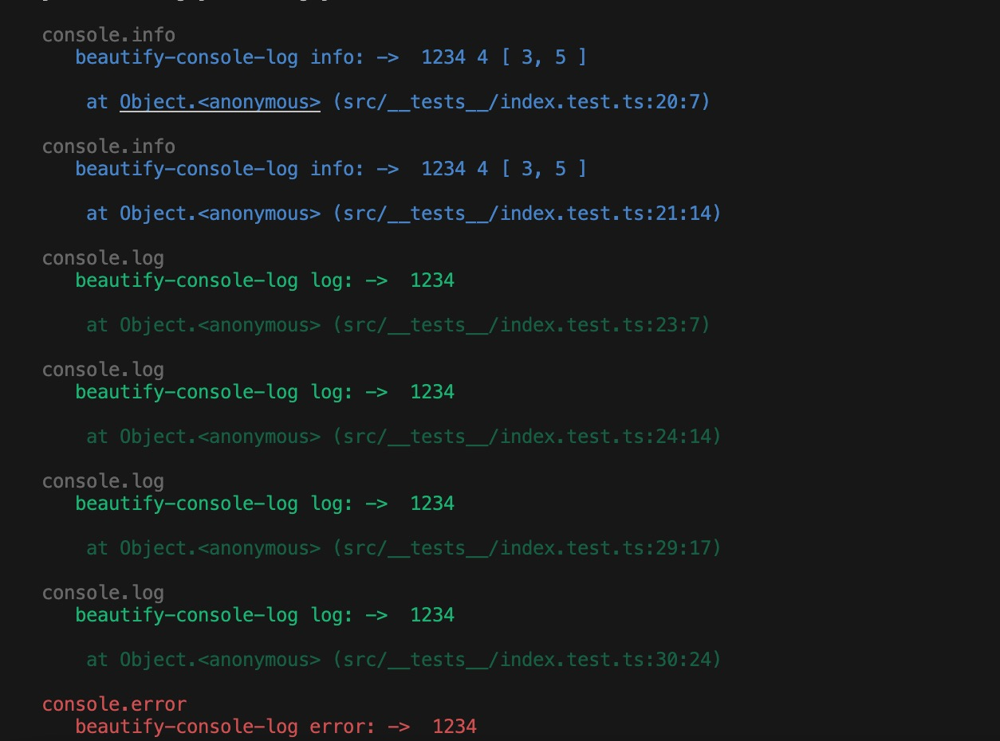
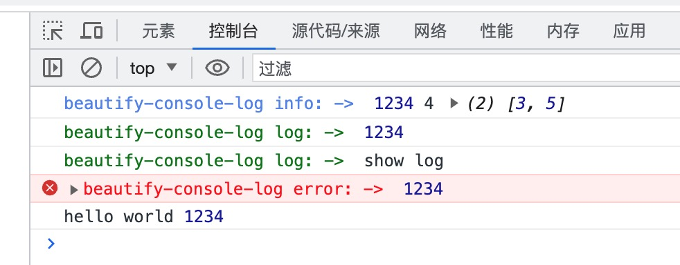

# beautify-console-log

#### 介绍
这是“console”对象的进一步美化和封装，包括console.log、console.info、console.warn、console.error。
可以加入自定义的console打印前缀、对内容进行美化（web端规则参考 https://developer.mozilla.org/en-US/docs/Web/API/Console ，node环境参考 https://zh.wikipedia.org/wiki/ANSI%E8%BD%AC%E4%B9%89%E5%BA%8F%E5%88%97），可随时关闭console打印，支持node环境。
查看效果请在控制台。

### 效果



#### 安装教程

```
npm i beautify-console-log --save
```
或
```
yarn add beautify-console-log
```

#### 使用说明

1.  简单使用
```
import BeautifyConsole from "beautify-console-log";
const log = BeautifyConsole.getInstance();
// 使用方式与正常的console.info()一致
log.info(1234, '4', [3, 5]);

```

或
```
const log = new BeautifyConsole();
// 使用方式与正常的console.info()一致
log.info(1234, '4', [3, 5]);

```


2.  支持的console类型
```
const log = BeautifyConsole.getInstance();
log.info(1234, '4', [3, 5]);
log.log(1234, '4', [3, 5]);
log.warn(1234, '4', [3, 5]);
log.error(1234, '4', [3, 5]);
```
3.  加入自定义console日志头
```
const log = BeautifyConsole.getInstance();
log.setPadStartText('log', 'hello world')
// or
log.setPadStartText('log', 'hello world').info(1234, '4', [3, 5]);
```
4.  关闭日志，传入参数就关闭对应的console日志类型，不传就关闭所有的类型，支持链式调用
```
const log = BeautifyConsole.getInstance();
log.close('info');
log.close('log');
log.close('warn');
log.close('error');
log.close();
log.close().open('error');

// or
log.open('error').open('log').open('warn').open('info');

// or
log.close('error').info('closed error');
log.close('error').error('closed error');

// or
log.close('error').open('info');
log.close('error').open('info').info('info...');
```
5.  打开日志，传入参数就打开对应的console日志类型，不传就打开所有的类型，支持链式调用
```
const log = BeautifyConsole.getInstance();
log.open('info');
log.open('log');
log.open('warn');
log.open('error');
log.open();
log.open().close('info');

//or
log.open('error').open('log').open('warn').open('info');

// or
log.open().info('closed error');
log.open('error').error('closed error');

// or
log.close('error').open('info');
log.close('error').open('info').info('info...');
```

#### 参与贡献

1.  Fork 本仓库
2.  新建 Feat_xxx 分支
3.  提交代码
4.  新建 Pull Request
