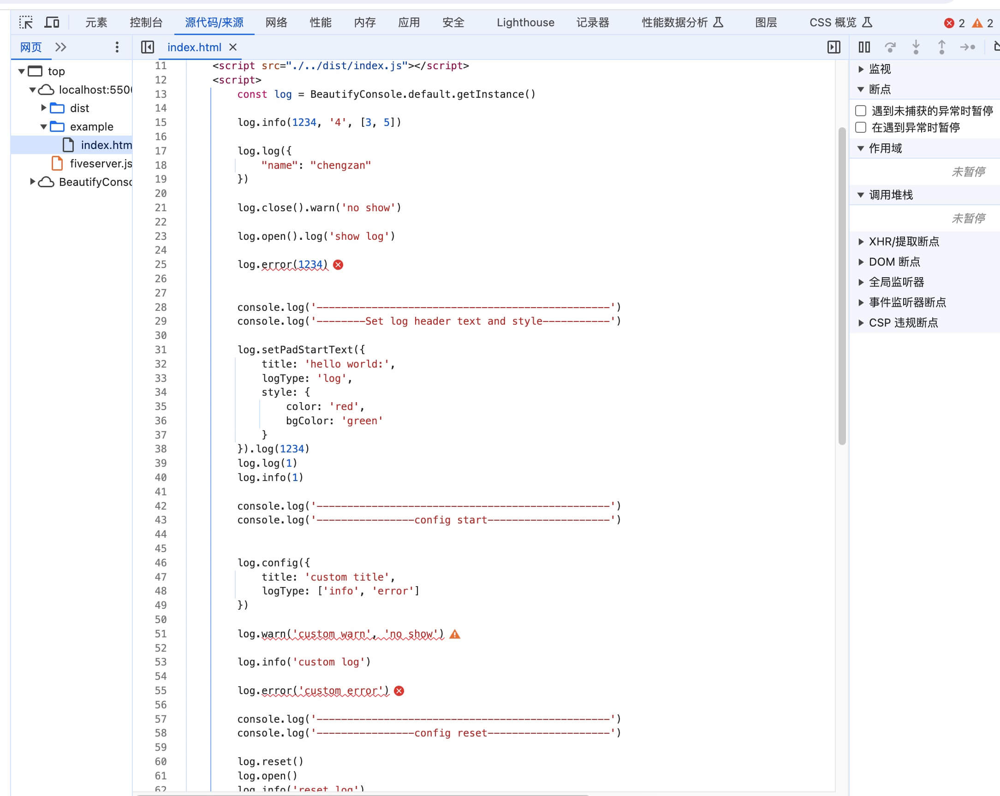
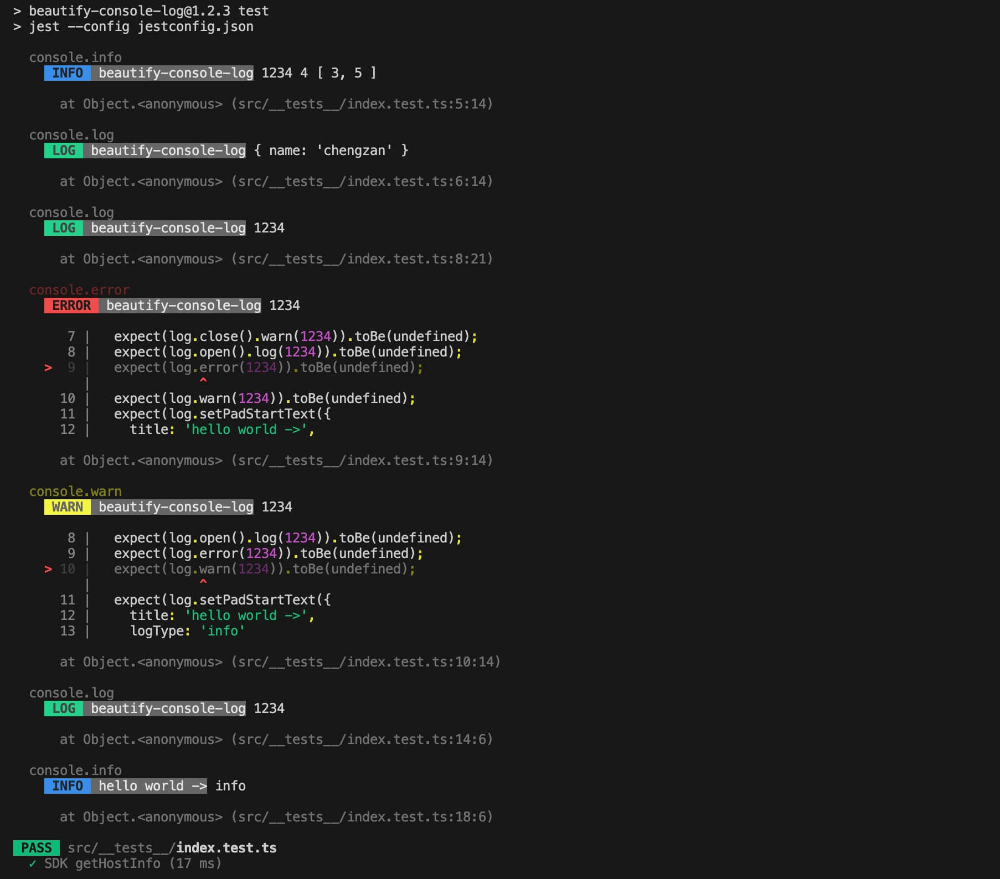

# beautify-console-log


## 介绍
由于大部分日志美化插件都不能定位到**代码所在行**，所以我自己实现了这个库。
- 这是“console”对象的进一步美化和封装，包括console.log、console.info、console.warn、console.error。
- 可以显示日志打印的所在行数，可以加入自定义的console打印前缀、对内容进行美化（web端规则参考 [https://developer.mozilla.org/en-US/docs/Web/API/Console](https://developer.mozilla.org/en-US/docs/Web/API/Console) ，node环境参考 [https://zh.wikipedia.org/wiki/ANSI%E8%BD%AC%E4%B9%89%E5%BA%8F%E5%88%97](https://zh.wikipedia.org/wiki/ANSI%E8%BD%AC%E4%B9%89%E5%BA%8F%E5%88%97)）， 可随时关闭console打印，支持node环境。
    > 查看效果请在控制台。

## 目录
- [效果](#效果)
- [安装教程](#安装教程)
- [API](#API)
- [使用说明](#使用说明)
- [参与贡献](#参与贡献)


## 效果

<p>

</p>
<p>

</p>
<p>

</p>


## 安装教程

```
npm i beautify-console-log --save
```
或
```
yarn add beautify-console-log
```

## API

### config
|参数名                          |值类型                         |描述                         |
|-------------------------------|-----------------------------|-----------------------------|
|title                          |String                       |自定义日志头                   |
|logType                        |Array<String>               |显示的日志类型，设置后只显示对应的日志类型(`"info"`、`"log"`、`"warn"`、`"error"`)|
```
import BeautifyConsole from "beautify-console-log";
const log = BeautifyConsole.getInstance();
log.config({
    title: 'custom title',
    logType: ['info', 'error']
})
// 使用方式与正常的console.info()一致
log.info(1234, '4', [3, 5]);
```
### log
> 使用方式与正常的console.log()一致
```
import BeautifyConsole from "beautify-console-log";
const log = BeautifyConsole.getInstance();
log.log(1234, '4', [3, 5]);
log.log({
    "name": "chengzan"
});
```

### info
> 使用方式与正常的console.info()一致
```
import BeautifyConsole from "beautify-console-log";
const log = BeautifyConsole.getInstance();
log.info(1234, '4', [3, 5]);
log.info({
    "name": "chengzan"
});
```

### warn
> 使用方式与正常的console.warn()一致
```
import BeautifyConsole from "beautify-console-log";
const log = BeautifyConsole.getInstance();=
log.warn(1234, '4', [3, 5]);
log.warn('warn');
```

### error
> 使用方式与正常的console.error()一致
```
import BeautifyConsole from "beautify-console-log";
const log = BeautifyConsole.getInstance();
log.error(1234, '4', [3, 5]);
log.error('warn');
```

### open
使用`log.close()`关闭日志后，可以`log.open()`进行打开对应的日志类型，打开所有类型日志时，不传参（支持链式调用）。
|值类型                         |描述                         |
|-----------------------------|-----------------------------|
|String?                       |`info`、`log`、`warn`、`error`，或者不传|
```
import BeautifyConsole from "beautify-console-log";
const log = BeautifyConsole.getInstance();
log.open() // 打开所有类型日志
// 或者
log.open('info') // 打开info日志
// 或者
log.open('info').open('error') // 打开info日志
```

### close
关闭日志，可以关闭全部日志或者某个类型的日志。
|值类型                         |描述                         |
|-----------------------------|-----------------------------|
|String?                       |`info`、`log`、`warn`、`error`，或者不传|
```
import BeautifyConsole from "beautify-console-log";
const log = BeautifyConsole.getInstance();
log.close() // 关闭所有类型日志
// 或者
log.close('info') // 关闭info日志
// 或者
log.close('info').open('log')
```

### setPadStartText
设置日志头文本内容及文本样式
|参数名                          |值类型                         |描述                         |
|-------------------------------|-----------------------------|-----------------------------|
|title                          |String                       |自定义日志头                   |
|logType                        |String              |`info`,`log`,`warn`,`error`|
|style                        |Object              |`info`,`log`,`warn`,`error`|
|                        |├──color              |`black`,`red`,`green`,`yellow`,`blue`,`purple`,`cyan`,`white`|
|                        |└──bgColor              |`black`,`red`,`green`,`yellow`,`blue`,`purple`,`cyan`,`white`|
```
import BeautifyConsole from "beautify-console-log";
const log = BeautifyConsole.getInstance();
log.close() // 关闭所有类型日志
// 或者
log.close('info') // 关闭info日志
// 或者
log.close('info').open('log')
```

### reset
当设置自定义日志头或关闭部分日志等操作后，可以通过`log.reset()`重置。
```
import BeautifyConsole from "beautify-console-log";
const log = BeautifyConsole.getInstance();

log.config({
    title: 'custom title',
    logType: ['info', 'error']
})

log.reset() // 打开所有类型日志
log.info('reset log')
```


## 使用说明

1.  简单使用
```
import BeautifyConsole from "beautify-console-log";
const log = BeautifyConsole.getInstance();
// 使用方式与正常的console.info()一致
log.info(1234, '4', [3, 5]);

```

或
```
const log = new BeautifyConsole();
// 使用方式与正常的console.info()一致
log.info(1234, '4', [3, 5]);

```
也可以直接使用 `dist/index.js` 文件
```
<script src="./dist/index.js">
```
```
const log = BeautifyConsole.default.getInstance()

log.info(1234, '4', [3, 5])

log.log({
    "name": "chengzan"
})

log.close().warn('no show')

log.open().log('show log')

log.error(1234)


console.log('------------------------------------------------')
console.log('--------Set log header text and style-----------')

log.setPadStartText('log', 'hello world:', {
    color: 'red',
    bgColor: 'green'
}).log(1234)
log.log(1)

console.log('------------------------------------------------')
console.log('----------------config start--------------------')


log.config({
    title: 'custom title',
    logType: ['info', 'error']
})

log.warn('custom warn', 'no show')

log.info('custom log')

log.error('custom error')

console.log('------------------------------------------------')
console.log('----------------config reset--------------------')

log.reset()
log.info('reset log')
log.warn('reset warn')
```

2.  初始化配置
```
const log = BeautifyConsole.getInstance();
log.config({
    title: 'example pad start text', // 左侧填充的日志头内容
    logType: ['info', 'error', 'warn', 'log'], // 显示部分日志类型
})
log.info(1234, '4', [3, 5]);
log.log(1234, '4', [3, 5]);
log.warn(1234, '4', [3, 5]);
log.error(1234, '4', [3, 5]);
```


3.  支持的console类型
```
const log = BeautifyConsole.getInstance();
log.info(1234, '4', [3, 5]);
log.log(1234, '4', [3, 5]);
log.warn(1234, '4', [3, 5]);
log.error(1234, '4', [3, 5]);
```
4.  加入自定义console日志头
```
const log = BeautifyConsole.getInstance();
log.setPadStartText('log', 'hello world')
// or
log.setPadStartText('log', 'hello world').info(1234, '4', [3, 5]);
```
5.  关闭日志，传入参数就关闭对应的console日志类型，不传就关闭所有的类型，支持链式调用
```
const log = BeautifyConsole.getInstance();
log.close('info');
log.close('log');
log.close('warn');
log.close('error');
log.close();
log.close().open('error');

// or
log.open('error').open('log').open('warn').open('info');

// or
log.close('error').info('closed error');
log.close('error').error('closed error');

// or
log.close('error').open('info');
log.close('error').open('info').info('info...');
```
6.  打开日志，传入参数就打开对应的console日志类型，不传就打开所有的类型，支持链式调用
```
const log = BeautifyConsole.getInstance();
log.open('info');
log.open('log');
log.open('warn');
log.open('error');
log.open();
log.open().close('info');

//or
log.open('error').open('log').open('warn').open('info');

// or
log.open().info('closed error');
log.open('error').error('closed error');

// or
log.close('error').open('info');
log.close('error').open('info').info('info...');
```

## 参与贡献

1.  Fork 本仓库
2.  新建 Feat_xxx 分支
3.  提交代码
4.  新建 Pull Request
